# 「知识分享」博客 · 界面设计说明书

| 项目名称 | 基于开源项目 DjangoBlog 二次开发的「知识分享」博客 |
|---|---|
| 开发小组 | 第 13 组 |
| 小组成员 | 丁昊（组长）、席佳宁、其余 3 名组员 |
| 文档版本 | v1.0 |
| 编写日期 | 2026-10-07 |
| 适用系统版本 | 本地部署版（Django 5.2 + MySQL 9.4，访问地址 `http://127.0.0.1:8001`） |

---

## 1 引言

### 1.1 编写目的

本说明书对「知识分享」博客系统的**用户界面设计**进行完整说明，内容包括：

1. 系统包含哪些用户界面，每个界面的布局、元素和设计要点（以截屏形式给出）；
2. 界面之间的**流转关系**（以流程图和思维导图形式说明）；
3. 每个界面对应的**模板**的功能，模板之间、模板与模板标签（tag）之间的**继承、包含关系**；
4. 使用 UML 中的**包图**对上述模板关系进行建模。

本文档供小组开发、测试、验收环节使用，同时作为课程作业的提交材料之一。

### 1.2 项目概述

「知识分享」博客是在开源博客系统 **DjangoBlog** 基础上二次开发的博客网站，包含文章、分类、标签、评论、搜索、第三方登录、后台管理等完整功能。主要技术构成：

- **后端**：Python 3.10+ / Django 5.2；
- **数据**：MySQL（文章、用户、评论数据），Redis / 本地内存（缓存）；
- **前端**：Alpine.js + Tailwind CSS + HTMX，Vite 构建；
- **搜索**：Whoosh / Elasticsearch；
- **插件体系**：通过钩子（hook）向界面注入功能的插件机制。

### 1.3 术语说明

| 术语 | 说明 |
|---|---|
| 模板（Template） | Django 模板文件（`.html`），负责把数据渲染成页面 |
| 继承（extends） | 子模板通过 `` 复用父模板的整体骨架 |
| 包含（include） | 通过 `` 在模板中嵌入另一个模板片段 |
| 模板标签/过滤器（tag/filter） | `` 引入的自定义标签库，如 `blog_tags` |
| 包含标签（inclusion_tag） | 一种自定义标签：调用它即自动渲染指定的片段模板 |
| 包图（Package Diagram） | UML 图之一，用「包」与「依赖」表示元素的分组与引用关系 |

---

## 2 界面设计概述

### 2.1 设计风格

- **整体风格**：现代简洁、卡片式布局，内容区圆角白卡片 + 柔和阴影，界面语言为中文。
- **主色与主题**：以青绿色为主色（用于标题、链接、强调按钮）；支持**明/暗双主题**，可跟随系统设置或手动切换（`base.html` 中内联防闪烁脚本在样式加载前执行，避免主题跳变）。
- **技术风格**：Tailwind CSS 原子类统一样式；Alpine.js / HTMX 提供轻量的无刷新交互；图标统一使用内联 SVG。
- **响应式**：桌面端为「主内容 + 右侧边栏」双栏布局；窄屏（移动端）自动变为单栏，顶部导航折叠为汉堡菜单（见截图 E-01）。

### 2.2 页面总体布局

| 区域 | 内容 |
|---|---|
| 顶部导航 | 站点 Logo/站名、首页、各分类、归档、外链（工具站）、站内搜索框、明暗主题切换、（移动端）汉堡菜单 |
| 主内容区 | 随页面变化：文章列表 / 文章正文 / 表单 / 搜索结果等 |
| 右侧边栏 | 热门文章、近期评论、标签云、近期文章、GitHub 项目卡片、功能入口（管理站点 / 登录） |
| 页脚 | 站点名与简介、快捷导航（首页/归档/工具站/RSS/GitHub）、构建信息、版权信息 |

### 2.3 界面清单

| 编号 | 界面名称 | 访问路径 | 主要功能 |
|---|---|---|---|
| A-01 | 首页 | `/` | 近期文章列表 + 侧边栏 |
| A-02 | 文章详情页 | `/article/<年>/<月>/<日>/<id>.html` | 正文阅读、阅读时间、版权声明、相关推荐、评论区 |
| A-03 | 分类页 | `/category/<分类slug>.html` | 某分类下的文章列表 |
| A-04 | 标签页 | `/tag/<标签slug>.html` | 某标签下的文章列表 |
| A-05 | 归档页 | `/archives.html` | 按年月分组浏览全部文章 |
| A-06 | 搜索页 | `/search?q=<关键词>` | 站内搜索，结果标题高亮显示 |
| A-07 | 友情链接页 | `/links.html` | 友链列表 |
| B-01 | 登录页 | `/login/` | 账号登录，含第三方登录入口 |
| B-02 | 注册页 | `/register/` | 新用户注册 |
| B-03 | 找回密码页 | `/forget_password/` | 通过邮箱重置密码 |
| C-01 | 后台登录页 | `/admin/login/` | 后台管理的登录入口 |
| D-01 | 404 错误页 | 任意不存在的地址 | 错误提示 + 返回首页/上一页 |
| E-01 | 移动端布局 | `/`（窄屏） | 响应式单栏 + 汉堡菜单 |

---

## 3 界面截屏与说明

> 以下截屏均来自本地部署的实际系统（浏览器 1440×2100 视口，移动端为 480 宽视口）。

### A-01 首页

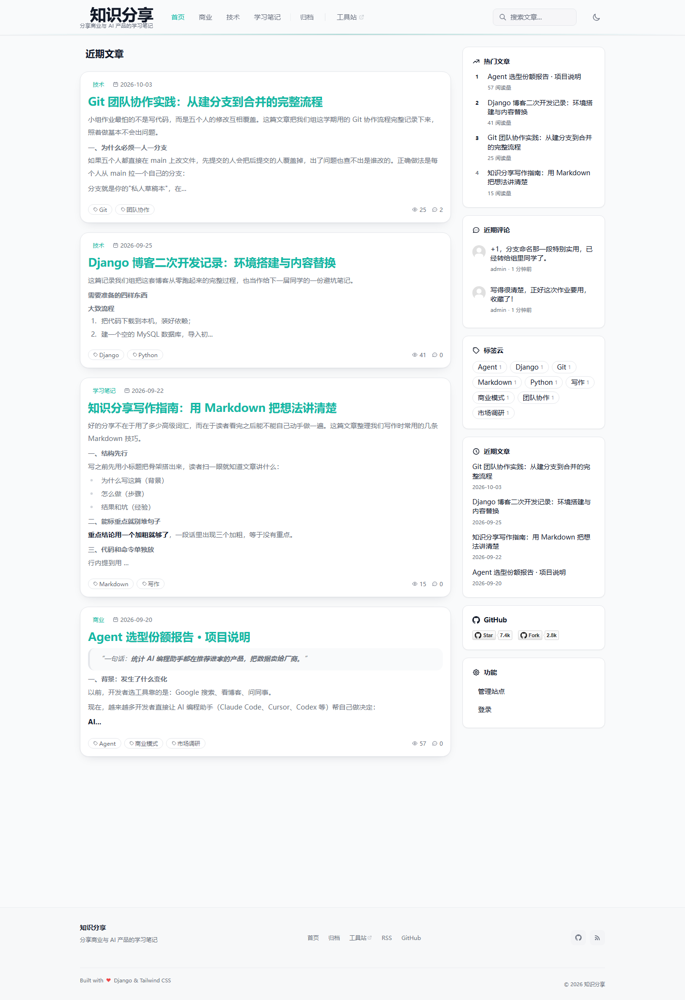

首页是系统的入口界面。**主内容区**按发布时间倒序展示文章卡片列表：每张卡片包含分类、发布日期、标题（悬停为强调色）、正文摘要、标签、浏览量/评论数图标。**右侧边栏**依次为：热门文章（按浏览量排序）、近期评论、标签云、近期文章、GitHub 项目卡片、功能入口（管理站点/登录）。**顶部导航**中每个分类都以下拉菜单形式展开其子分类；右侧为搜索框与明暗主题切换按钮。整页共用的**页脚**包含站点信息、快捷导航与版权行。

### A-02 文章详情页

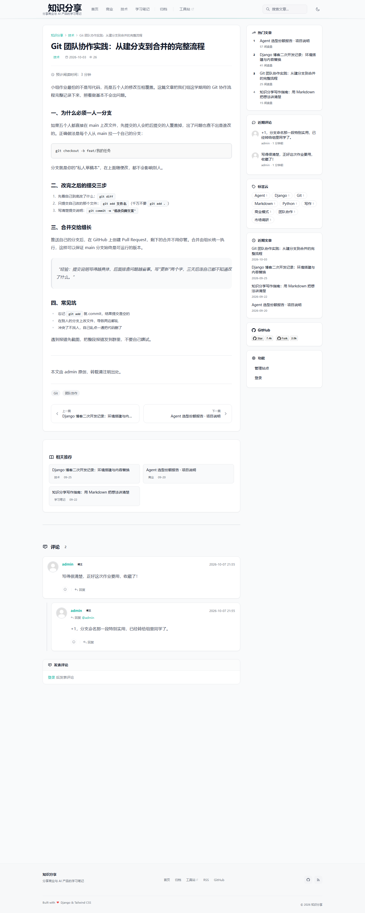

文章详情页是内容阅读界面，从上到下依次为：

1. **面包屑**（首页 › 分类 › 当前文章），体现当前位置；
2. **标题区**：分类、发布日期、**预计阅读时间**（由「阅读时间」插件自动计算注入）；
3. **正文区**：支持标题、列表、代码块、引用等 Markdown 渲染样式；
4. **版权声明**（由「版权声明」插件在正文末尾自动追加）；
5. **标签列表**，可点击进入对应标签页；
6. **上一篇 / 下一篇**导航条；
7. **相关推荐**（由「文章推荐」插件按标签/分类相关性渲染的卡片列表）；
8. **评论区**：评论列表支持无限嵌套回复，未登录时提示登录后发表评论。

### A-03 分类页

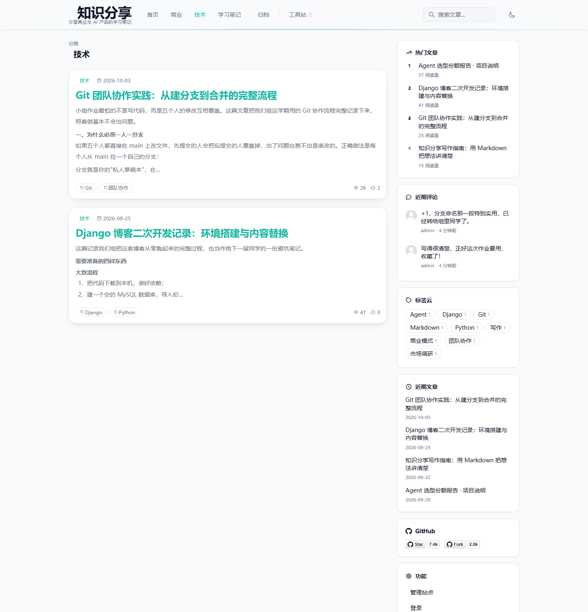

分类页展示某个分类下的全部文章，布局与首页一致（卡片列表 + 侧边栏 + 分页控件），页面顶部显示当前分类名。顶部导航的各个分类下拉项最终都指向本界面。

### A-04 标签页

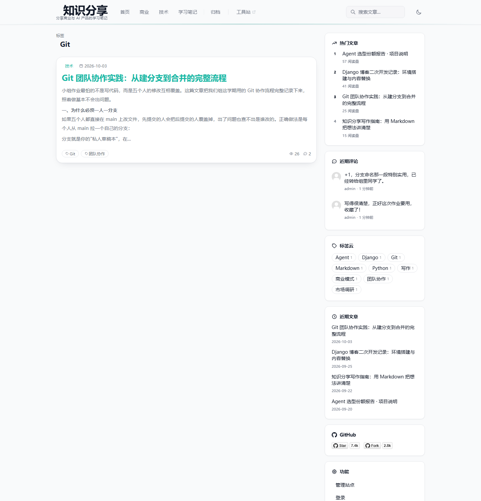

标签页展示带有某个标签的全部文章，页面顶部显示标签名称与文章数，卡片中的标签云、文章详情页的标签列表均可跳转到本界面。

### A-05 归档页

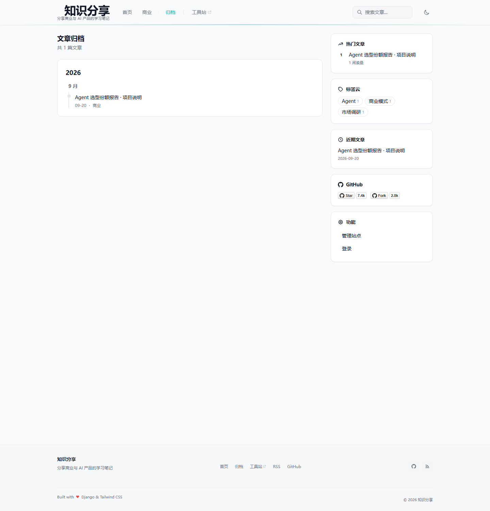

归档页按「年份 → 月份」分组展示全部已发布文章，适合按时间线浏览历史内容。

### A-06 搜索页

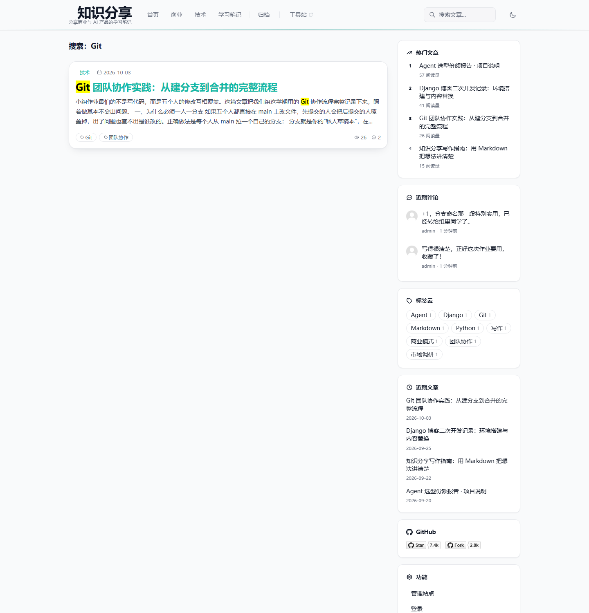

搜索页展示关键词的搜索结果：结果条目的**标题中命中关键词的部分高亮显示**；无结果时显示空状态提示。搜索框位于顶部导航，任意界面均可发起搜索。

### A-07 友情链接页

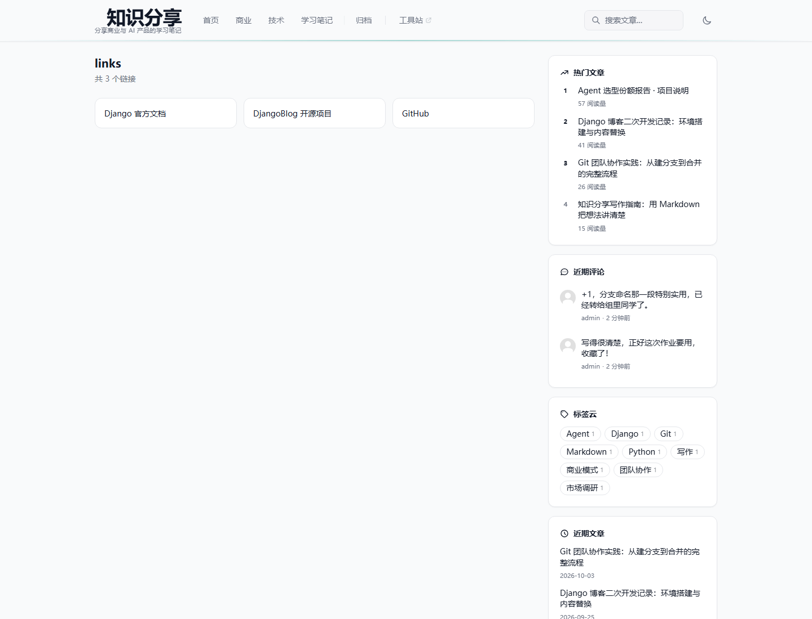

友情链接页以列表形式展示站点收录的友情链接（本站为 Django 官方文档、DjangoBlog 开源项目、GitHub 三条），点击在新窗口打开。

### B-01 登录页

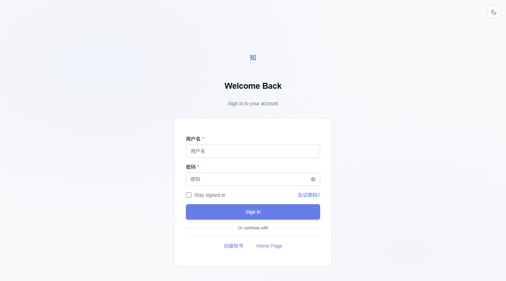

登录页采用账号页专用的简洁母版（`base_account.html`）：居中卡片式表单（用户名/密码、「记住我」、登录按钮），下方为「注册」「忘记密码」入口；登录表单下方为第三方登录（OAuth）按钮区，具体平台由后台 OAuth 配置决定。

### B-02 注册页

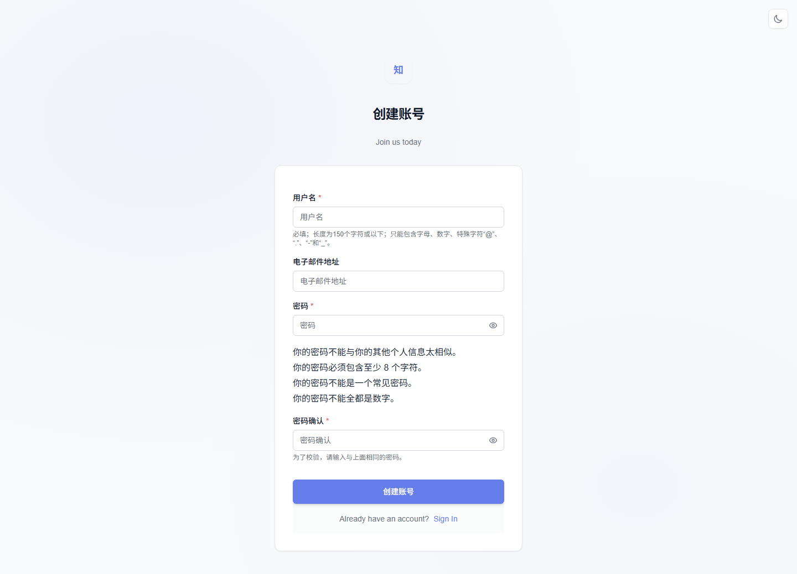

注册页同样使用账户页母版：居中卡片表单，包含用户名、邮箱、密码及确认密码，并提供注册协议勾选项。

### B-03 找回密码页

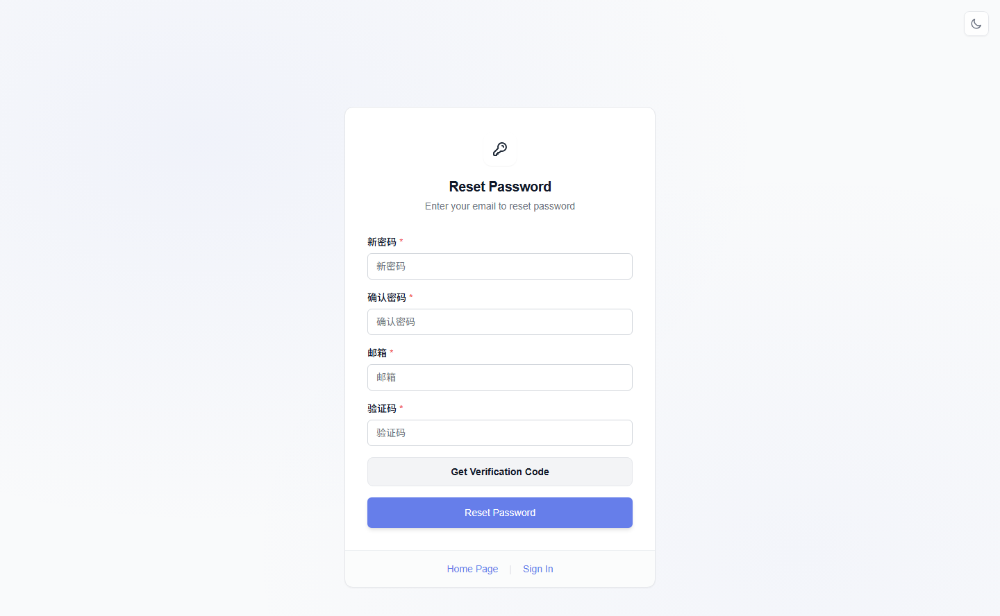

找回密码页沿用账户页母版：输入注册邮箱后由系统发送重置验证码，用于忘记密码时的账户找回，是登录链路上的重要补充界面。

### C-01 后台登录页

后台管理登录页，登录成功后由管理员维护文章、分类、标签、评论、用户、插件配置和友链站点等全部数据。

### D-01 404 错误页

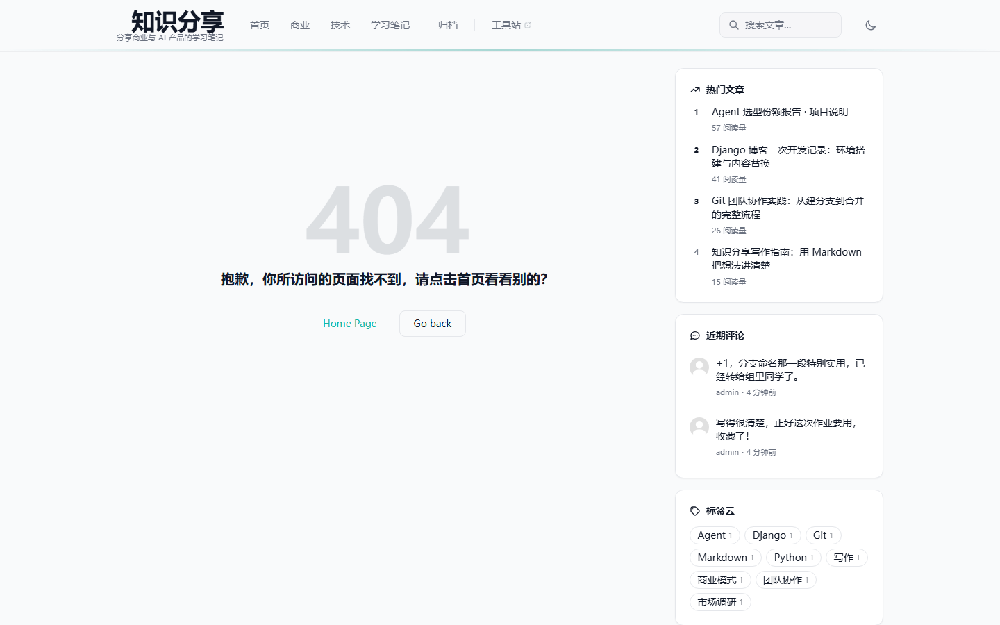

访问不存在的地址时进入 404 错误页：显示醒目的「404」标识与中文提示文案，并提供「返回首页」「回到上一页」两个操作入口，保证用户不因错误地址而迷失。

### E-01 移动端布局（响应式）

在窄屏（手机）宽度下，同一套模板自动切换为**单栏布局**：侧边栏隐藏，文章卡片自适应全宽，顶部导航折叠为「汉堡菜单」，展开后以抽屉形式显示全部分类与站点链接。

---

## 4 界面流转关系

### 4.1 界面流转图

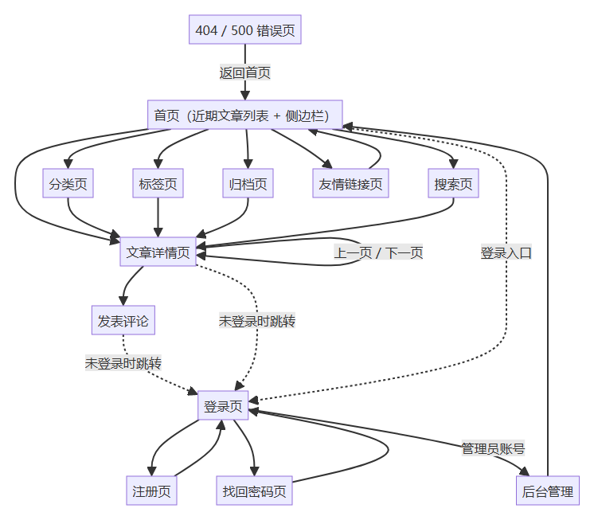

### 4.2 主要流转路径说明

| 序号 | 来源界面 | 目标界面 | 触发方式 |
|---|---|---|---|
| 1 | 首页 | 文章详情页 | 点击任意文章卡片标题 |
| 2 | 首页 | 分类页 / 标签页 / 归档页 / 搜索页 / 友链页 | 顶部导航、侧边栏标签云、「近期文章」等入口 |
| 3 | 分类页 / 标签页 / 归档页 / 搜索页 | 文章详情页 | 点击列表条目标题 |
| 4 | 文章详情页 | 文章详情页（上一篇/下一篇、相关推荐） | 点击正文下方导航条或推荐卡片 |
| 5 | 文章详情页 | 标签页 / 分类页 | 点击面包屑、分类、标签 |
| 6 | 文章详情页 | 登录页 | 未登录状态下点击评论输入框（提示登录后评论） |
| 7 | 首页等任意页 | 登录页 | 侧边栏「功能 → 登录」 |
| 8 | 登录页 | 注册页 / 找回密码页 | 表单下方链接，完成后返回登录页 |
| 9 | 登录页（管理员账号） | 后台管理 | 侧边栏「管理站点」或直接访问 `/admin/` |
| 10 | 任意错误地址 | 404 错误页 | 自动跳转，页内提供返回首页/上一页 |
| 11 | 移动端任意页 | 导航抽屉 | 点击汉堡菜单按钮展开完整导航 |

### 4.3 界面思维导图

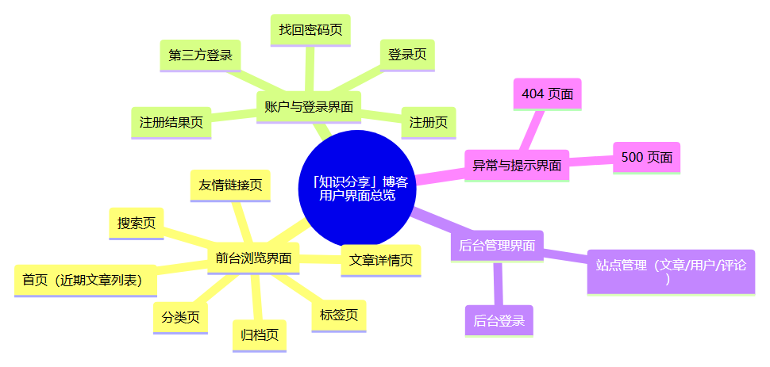

思维导图从四个维度归纳系统全部界面：

- **前台浏览界面**：首页、文章详情页、分类页、标签页、归档页、搜索页、友情链接页——供访客浏览内容，是界面的主体；
- **账户与登录界面**：登录页、注册页、找回密码页、第三方登录（OAuth 授权页）、注册结果页；
- **后台管理界面**：后台登录页与站点管理（文章、用户、评论等数据维护）；
- **异常与提示界面**：404 页面、500 页面。

---

## 5 模板功能与关系分析

系统全部界面由 38 个模板文件实现，按目录分为 4 组：基础布局（`share_layout/`）、文章界面（`blog/`）、评论界面（`comments/`）、账户与登录（`account/`、`oauth/`）、搜索（`search/`）、插件模板（`plugins/`）。

### 5.1 模板功能分析

**（1）基础布局模板 `share_layout/`**

| 模板 | 功能 |
|---|---|
| `base.html` | **前台总母版**。定义完整 HTML 骨架：head（SEO 元信息、主题防闪烁脚本、资源引用）、顶部导航、内容区块（`block`）、页脚、公共脚本 |
| `base_account.html` | **账户页母版**（登录/注册/找回密码），独立的简洁骨架，不继承 `base.html` |
| `nav.html` | 顶部导航栏：站名、首页、分类下拉、归档、外链、搜索框、主题切换；内部同时实现桌面版与移动版两套结构 |
| `nav_node.html`、`nav_node_mobile.html` | 递归渲染分类树的导航片段（含嵌套子分类） |
| `footer.html` | 页脚：站点信息、快捷导航、RSS/GitHub 图标、版权行 |
| `adsense.html` | 预留的广告位模板（当前未启用） |

**（2）文章界面模板 `blog/`**

| 模板 | 功能 |
|---|---|
| `article_index.html` | 首页/文章列表页：渲染文章卡片列表 + 侧边栏 + 分页 |
| `article_detail.html` | 文章详情页：面包屑、标题元信息、正文、标签、翻页、相关推荐、评论区 |
| `article_archives.html` | 归档页：按年/月分组列出文章 |
| `links_list.html` | 友情链接页 |
| `error_page.html` | 错误页（404/500），显示提示与返回按钮 |
| `tags/article_info.html` | **文章卡片片段**：列表中的单篇文章条目（标题、摘要、标签、统计） |
| `tags/article_info_highlight.html` | 搜索结果的文章条目片段（标题关键词高亮） |
| `tags/article_meta_info.html` | 文章元信息片段：分类、作者、日期、（插件注入的）浏览量等 |
| `tags/article_tag_list.html` | 文章标签列表片段 |
| `tags/article_pagination.html` | 分页控件片段 |
| `tags/breadcrumb.html` | 面包屑导航片段 |
| `tags/sidebar.html` | 侧边栏片段：热门文章、近期评论、标签云、近期文章、GitHub 卡片、功能入口 |

**（3）评论界面模板 `comments/`**

| 模板 | 功能 |
|---|---|
| `tags/comment_list_modern.html` | 评论列表容器（当前使用的现代版界面） |
| `tags/comment_item_modern.html` | 单条评论片段，**自包含递归**实现无限嵌套回复 |
| `tags/post_comment_modern.html` | 发表评论表单（未登录时显示登录提示） |
| `tags/comment_list.html`、`tags/comment_item.html`、`tags/comment_item_tree.html`、`tags/post_comment.html` | 旧版评论模板（保留未引用，其中 `comment_item_tree.html` 通过变量模板名递归） |

**（4）账户与登录模板 `account/`、`oauth/`**

| 模板 | 功能 |
|---|---|
| `account/login.html` | 登录页：登录表单 + 第三方登录按钮区 |
| `account/registration_form.html` | 注册页：注册表单 |
| `account/forget_password.html` | 找回密码页 |
| `account/result.html` | 通用结果页（如注册完成提示） |
| `oauth/oauth_applications.html` | 第三方登录按钮片段（由标签渲染到登录页/详情页） |
| `oauth/bindsuccess.html` | 第三方账号绑定成功页 |
| `oauth/require_email.html` | 第三方登录补充邮箱页 |

**（5）搜索与插件模板**

| 模板 | 功能 |
|---|---|
| `search/search.html` | 搜索结果页：结果列表（标题高亮）+ 侧边栏 |
| `plugins/css_includes.html`、`plugins/js_includes.html` | 汇总各插件需要引入的 CSS/JS 资源（由标签动态渲染） |
| `plugins/article_recommendation/bottom_widget.html` | 文章底部「相关推荐」卡片（插件渲染） |
| `plugins/article_recommendation/sidebar_widget.html` | 侧边栏推荐位（可选，当前未启用） |

### 5.2 模板继承关系

系统采用**两层继承体系**：前台页面统一继承 `base.html`，账户类页面统一继承 `base_account.html`。

| 子模板（继承者） | 父模板（被继承） |
|---|---|
| `blog/article_index.html`（首页） | `share_layout/base.html` |
| `blog/article_detail.html`（文章详情） | `share_layout/base.html` |
| `blog/article_archives.html`（归档） | `share_layout/base.html` |
| `blog/links_list.html`（友链） | `share_layout/base.html` |
| `blog/error_page.html`（错误页） | `share_layout/base.html` |
| `search/search.html`（搜索） | `share_layout/base.html` |
| `account/result.html`（结果页） | `share_layout/base.html` |
| `oauth/bindsuccess.html`（绑定成功） | `share_layout/base.html` |
| `account/login.html`（登录） | `share_layout/base_account.html` |
| `account/registration_form.html`（注册） | `share_layout/base_account.html` |
| `account/forget_password.html`（找回密码） | `share_layout/base_account.html` |
| `oauth/require_email.html`（补充邮箱） | `share_layout/base_account.html` |

特点：所有页面模板只负责填充父模板预留的 `block`（标题、内容等），头部、导航、页脚、公共资源由母版统一提供，**页面之间风格天然一致，且修改一处全站生效**。

### 5.3 模板包含关系

| 宿主模板 | 被包含模板 | 说明 |
|---|---|---|
| `share_layout/base.html` | `share_layout/nav.html`、`share_layout/footer.html` | 母版嵌入导航与页脚 |
| `blog/article_detail.html` | `comments/tags/comment_list_modern.html`、`comments/tags/post_comment_modern.html` | 详情页嵌入评论列表与发表框 |
| `comments/tags/comment_list_modern.html` | `comments/tags/comment_item_modern.html` | 列表渲染每条评论 |
| `comments/tags/comment_item_modern.html` | 自身（递归包含） | 嵌套回复逐层渲染 |
| `share_layout/nav.html` | `share_layout/nav_node.html` / `nav_node_mobile.html` | 分类树（片段自身递归展开子分类） |
| `comments/tags/comment_item_tree.html` | 自身（经 `template_name` 变量递归，旧版） | 旧版嵌套评论 |

### 5.4 模板与 tag（模板标签）的关系

系统的模板**片段**绝大多数不是被直接 `include` 的，而是由**自定义包含标签（inclusion_tag）**在页面渲染时调用并按需渲染。标签库位于各应用的 `templatetags/` 目录，页面模板通过 `` 引入后调用：

| 标签库 | 标签 | 渲染的模板 | 典型使用位置 |
|---|---|---|---|
| `blog_tags` | `load_breadcrumb` | `blog/tags/breadcrumb.html` | 文章详情页 |
| | `load_article_detail` | `blog/tags/article_info.html` | 首页、分类、标签、归档页 |
| | `load_article_detail_with_highlight` | `blog/tags/article_info_highlight.html` | 搜索页（高亮） |
| | `load_article_metas` | `blog/tags/article_meta_info.html` | 文章详情页 |
| | `load_articletags` | `blog/tags/article_tag_list.html` | 文章详情页 |
| | `load_pagination_info` | `blog/tags/article_pagination.html` | 各列表页 |
| | `load_sidebar` | `blog/tags/sidebar.html` | 所有前台页面 |
| | `plugin_compressed_css` / `plugin_compressed_js` | `plugins/css_includes.html` / `plugins/js_includes.html` | 母版 head / 页脚 |
| | `head_meta` | （不渲染模板，执行 `head_meta` 钩子） | 母版 head，SEO 插件由此注入元信息 |
| `comments_tags` | `show_comment_item` | `comments/tags/comment_item.html` | 旧版评论（当前未引用） |
| `oauth_tags` | `load_oauth_applications` | `oauth/oauth_applications.html` | 登录页、文章详情页 |
| `vite_tags` | `vite_asset` 等 | —（输出前端资源路径） | 母版中引用 Vite 构建产物 |

**关系总结**：模板（页面）——``→ 标签库 ——`包含标签`→ 片段模板 ——``→ 更小片段（可递归）。这条链路把「数据准备（Python）」与「界面片段（HTML）」解耦：改界面不用动 Python，改数据逻辑不用动界面。

### 5.5 插件对界面的注入点

插件机制是本站界面的一大特色：插件通过注册**钩子（hook）**向已渲染的界面内容中注入功能，不需要修改任何页面模板：

| 插件 | 注册的钩子 | 对界面的影响 |
|---|---|---|
| `reading_time`（阅读时间） | `the_content`（文章内容） | 文章标题下注入「预计阅读时间：X 分钟」 |
| `article_copyright`（版权声明） | `the_content` | 正文末尾追加「本文由 XX 原创……」版权行 |
| `external_links`（外链处理） | `the_content` | 正文外链自动加新窗口打开与图标 |
| `image_lazy_loading`（图片懒加载） | `the_content` | 正文图片懒加载 + 淡入效果 |
| `view_count`（浏览量） | `after_article_body_get` | 统计并显示文章浏览量 |
| `seo_optimizer`（SEO 优化） | `head_meta` | 向 head 注入 title/description/keywords 等 |
| `article_recommendation`（文章推荐） | `ARTICLE_DETAIL_LOAD` + 底部渲染 | 正文下方生成「相关推荐」卡片区 |

---

## 6 模板关系 UML 包图

### 6.1 包图

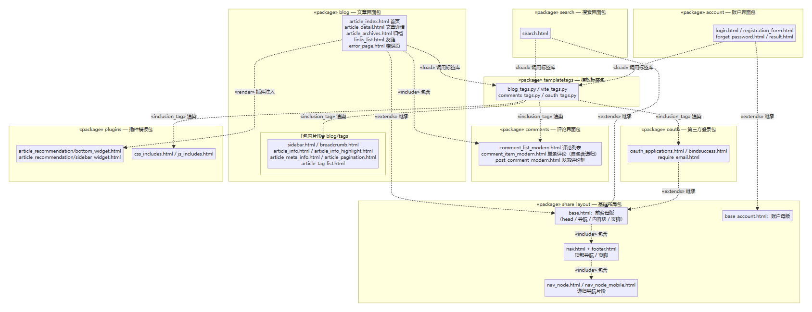

### 6.2 读图说明

图中每个**包（package）**对应模板体系中的一个功能分组；包之间的**虚线箭头**表示依赖，箭头上的构造型（`«extends»`、`«include»`、`«inclusion_tag»`、`«load»`、`«render»`）注明依赖方式：

| 依赖 | 构造型 | 含义 |
|---|---|---|
| 各页面包 → `share_layout` | `«extends»` 继承 | 页面模板继承母版骨架（`base.html` / `base_account.html`） |
| `share_layout` 内部：`base.html` → `nav/footer` | `«include»` 包含 | 母版静态包含导航与页脚片段 |
| `blog` → `comments` | `«include»` 包含 | 文章详情页包含评论列表与发表框 |
| `templatetags` → `blog/tags`、`comments`、`oauth`、`plugins` | `«inclusion_tag»` 渲染 | 标签库调用包含标签时渲染对应片段模板 |
| 各页面包 → `templatetags` | `«load»` 调用标签库 | 页面模板引入标签库并调用其标签 |
| `blog` → `plugins` | `«render»` 插件注入 | 插件运行时渲染推荐等插件模板并注入界面 |

### 6.3 设计评价

**优点**：

1. **继承体系清晰**：两层母版（前台/账户）覆盖全部页面，风格统一、维护成本低；
2. **片段化管理**：文章卡片、分页、侧边栏、评论等重复出现的界面单元全部片段化，由包含标签按需渲染，复用度高；
3. **解耦充分**：模板、标签库（Python）、插件三层分离——插件扩展界面（如阅读时间、版权、推荐）无需触碰任何页面模板；
4. **可扩展**：新增页面只需继承母版并填充区块；新增功能界面可通过新插件模板 + 钩子实现。

**可改进点**：

1. 评论模板存在新旧两套（`*_modern` 与旧版），旧版已不被界面引用，建议清理以减小维护面；
2. `blog/tags` 片段与 `blog_tags` 标签库绑定较紧，片段无法直接被其他标签复用；
3. `nav.html` 中桌面版与移动版导航为两份重复结构，可抽取共用片段进一步减少重复。

---

## 7 总结

「知识分享」博客的界面由 **13 个用户界面 + 4 类片段体系**构成，整体继承自两套母版，风格现代、支持明暗主题与移动端响应式；界面间通过「首页 ↔ 列表页 ↔ 详情页 ↔ 账户页 ↔ 后台」的流转网络连接，路径清晰、无死胡同（错误页提供返航入口）。模板层面形成「母版继承 → 片段包含 → 标签渲染 → 插件注入」四层结构，复用与解耦良好，并在 UML 包图中得到完整表达。

---

## 附录 A 图表源码（Mermaid）

> 以下源码与正文中的三张图一一对应，可在支持 Mermaid 的编辑器（如 VS Code、GitHub）中直接重新渲染。

**A.1 界面流转图**

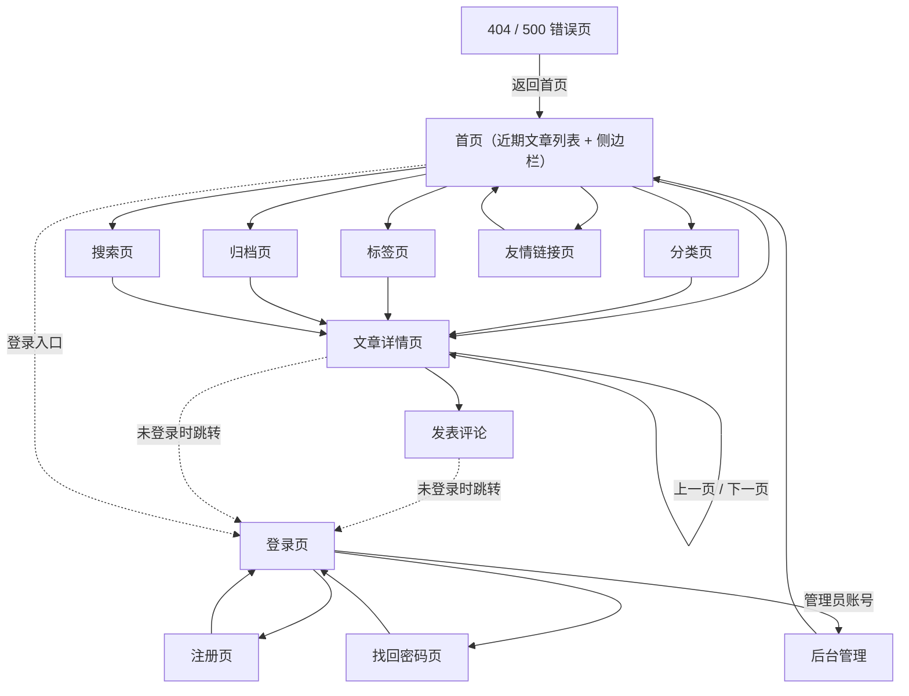
```mermaid
flowchart TD
    HOME["首页（近期文章列表 + 侧边栏）"]
    DETAIL["文章详情页"]
    CAT["分类页"]
    TAG["标签页"]
    ARCH["归档页"]
    SEARCH["搜索页"]
    LINKS["友情链接页"]
    LOGIN["登录页"]
    REG["注册页"]
    FORGET["找回密码页"]
    ADMIN["后台管理"]
    COMMENT["发表评论"]
    E404["404 / 500 错误页"]

    HOME --> CAT
    HOME --> TAG
    HOME --> ARCH
    HOME --> SEARCH
    HOME --> LINKS
    HOME --> DETAIL
    CAT --> DETAIL
    TAG --> DETAIL
    ARCH --> DETAIL
    SEARCH --> DETAIL
    LINKS --> HOME
    DETAIL --> COMMENT
    DETAIL -- 上一页 / 下一页 --> DETAIL
    COMMENT -. 未登录时跳转 .-> LOGIN
    DETAIL -. 未登录时跳转 .-> LOGIN
    HOME -. 登录入口 .-> LOGIN
    LOGIN --> REG
    LOGIN --> FORGET
    REG --> LOGIN
    FORGET --> LOGIN
    LOGIN -- 管理员账号 --> ADMIN
    ADMIN --> HOME
    E404 -- 返回首页 --> HOME
```

**A.2 界面思维导图**

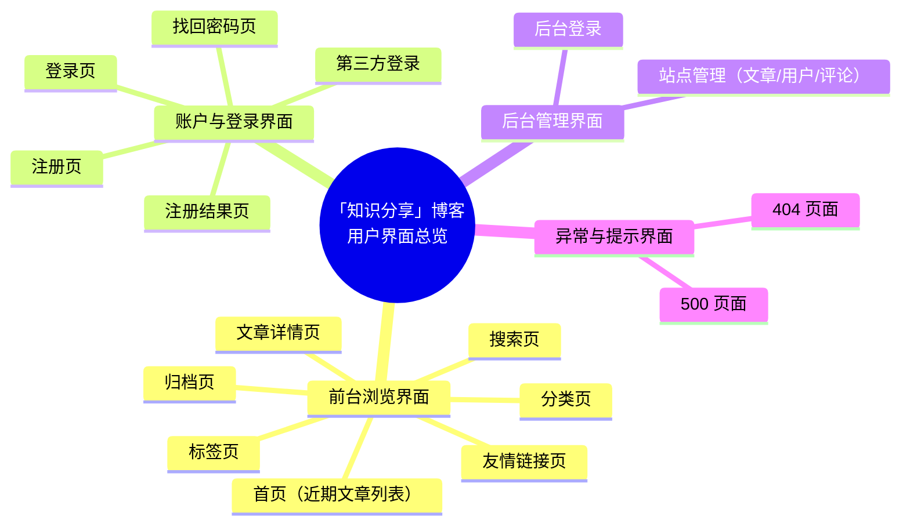
```mermaid
mindmap
  root(("「知识分享」博客<br/>用户界面总览"))
    前台浏览界面
      首页（近期文章列表）
      文章详情页
      分类页
      标签页
      归档页
      搜索页
      友情链接页
    账户与登录界面
      登录页
      注册页
      找回密码页
      第三方登录
      注册结果页
    后台管理界面
      后台登录
      站点管理（文章/用户/评论）
    异常与提示界面
      404 页面
      500 页面
```

**A.3 模板关系包图**

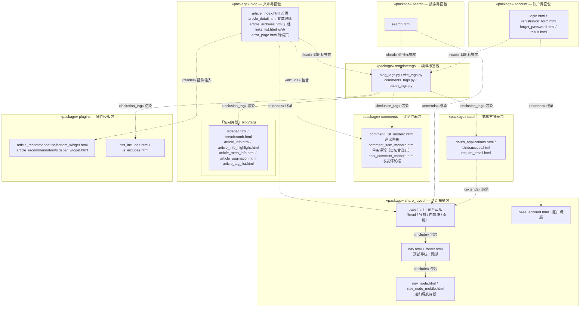
```mermaid
flowchart TB
    subgraph LAYOUT["«package» share_layout — 基础布局包"]
        BASE["base.html：前台母版<br/>（head / 导航 / 内容块 / 页脚）"]
        BASEACC["base_account.html：账户母版"]
        NAV["nav.html + footer.html<br/>顶部导航 / 页脚"]
        NAVNODE["nav_node.html / nav_node_mobile.html<br/>递归导航片段"]
    end
    subgraph BLOGP["«package» blog — 文章界面包"]
        PAGES["article_index.html 首页<br/>article_detail.html 文章详情<br/>article_archives.html 归档<br/>links_list.html 友链<br/>error_page.html 错误页"]
        subgraph BLOG_TAGS["「包内片段」blog/tags"]
            FRAGS["sidebar.html / breadcrumb.html<br/>article_info.html / article_info_highlight.html<br/>article_meta_info.html / article_pagination.html<br/>article_tag_list.html"]
        end
    end
    subgraph COMP["«package» comments — 评论界面包"]
        CFILES["comment_list_modern.html 评论列表<br/>comment_item_modern.html 单条评论（自包含递归）<br/>post_comment_modern.html 发表评论框"]
    end
    subgraph ACCP["«package» account — 账户界面包"]
        AFILES["login.html / registration_form.html<br/>forget_password.html / result.html"]
    end
    subgraph OAUTHP["«package» oauth — 第三方登录包"]
        OFILES["oauth_applications.html / bindsuccess.html<br/>require_email.html"]
    end
    subgraph SEARCHP["«package» search — 搜索界面包"]
        SFILE["search.html"]
    end
    subgraph PLUGP["«package» plugins — 插件模板包"]
        PFILES["article_recommendation/bottom_widget.html<br/>article_recommendation/sidebar_widget.html"]
        PINC["css_includes.html / js_includes.html"]
    end
    subgraph TAGP["«package» templatetags — 模板标签包"]
        TAGS["blog_tags.py / vite_tags.py<br/>comments_tags.py / oauth_tags.py"]
    end

    PAGES -.->|"«extends» 继承"| BASE
    SFILE -.->|"«extends» 继承"| BASE
    OFILES -.->|"«extends» 继承"| BASE
    AFILES -.->|"«extends» 继承"| BASEACC
    BASE -.->|"«include» 包含"| NAV
    NAV -.->|"«include» 包含"| NAVNODE
    PAGES -.->|"«include» 包含"| CFILES
    TAGS -.->|"«inclusion_tag» 渲染"| FRAGS
    TAGS -.->|"«inclusion_tag» 渲染"| CFILES
    TAGS -.->|"«inclusion_tag» 渲染"| OFILES
    TAGS -.->|"«inclusion_tag» 渲染"| PINC
    PAGES -.->|"«load» 调用标签库"| TAGS
    SFILE -.->|"«load» 调用标签库"| TAGS
    AFILES -.->|"«load» 调用标签库"| TAGS
    PAGES -.->|"«render» 插件注入"| PFILES
```

--- 

## 附录 B 截屏采集方法（可复现）

1. 启动数据库与服务：`D:\mysql-dh\start-mysql.cmd` → `.venv\Scripts\python.exe manage.py runserver 127.0.0.1:8001`；
2. 使用本机 Chrome 无头模式按视口尺寸截取各路径（桌面 1440 宽、移动 480 宽）：
   `chrome --headless=new --window-size=1440,2100 --screenshot=01-home.png http://127.0.0.1:8001/`；
3. 三张关系图由本附录 A 的 Mermaid 源码渲染后导出 PNG。

> 注：系统启用了页面级缓存（10 小时），批量截屏前如需刷新内容，重启一次 `runserver` 即可清除缓存。
